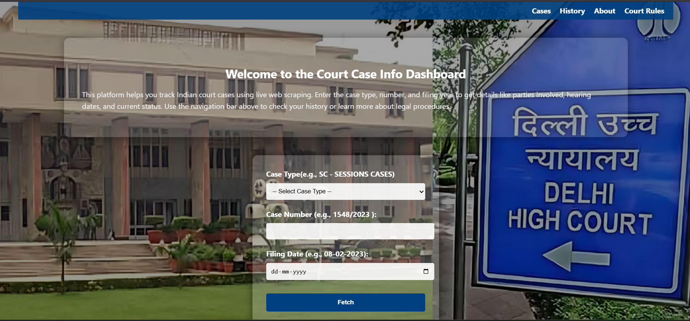
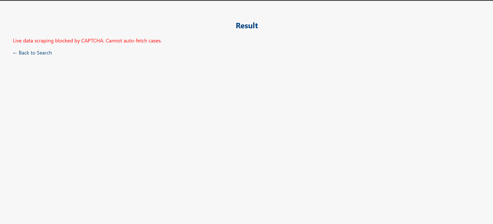
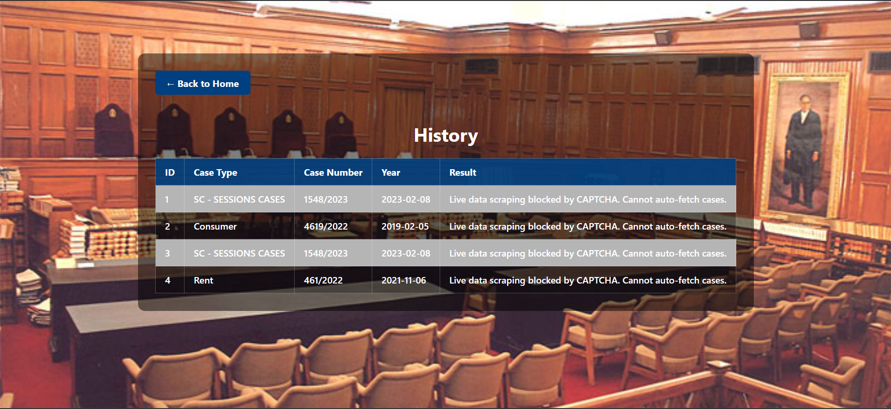
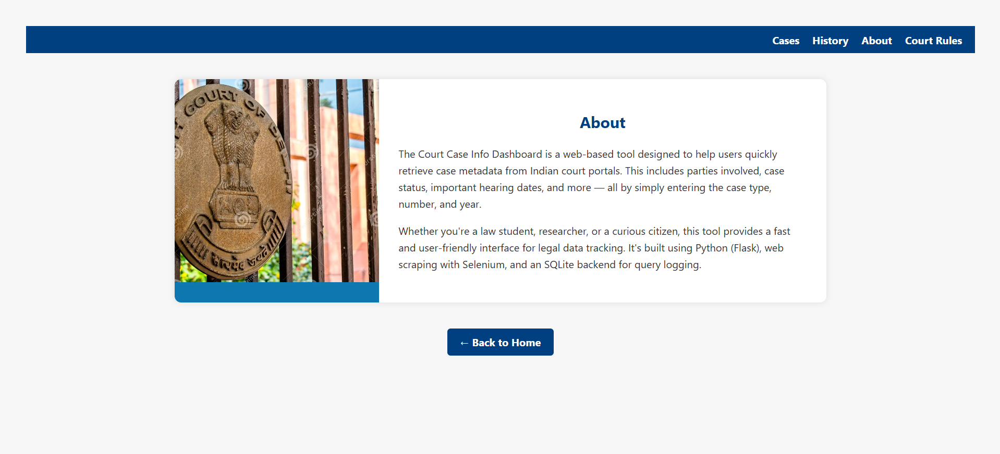
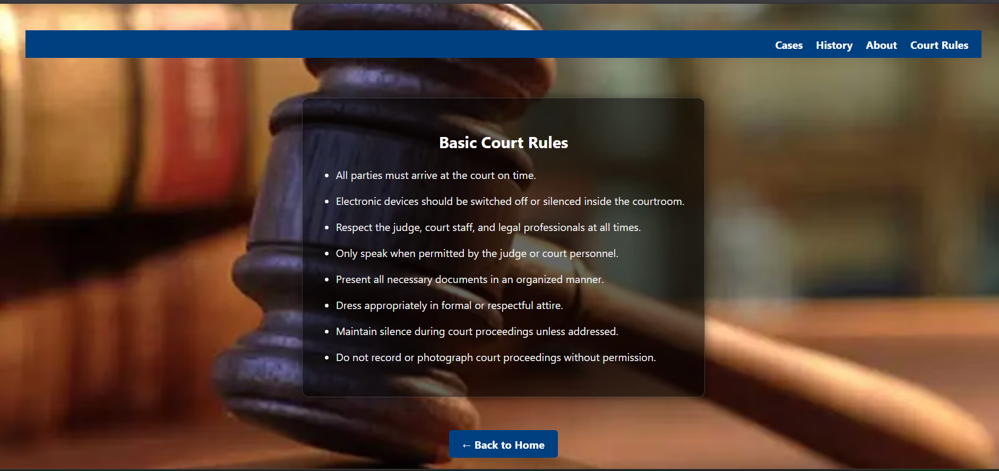

# Project Title
# 🏛️ Court Data Fetcher

A Flask web application to fetch case status and order history from the **Delhi High Court** website by case type, number, and year. It stores query logs in a SQLite database and displays them in a history table.

index.HTML

result.HTML

logs.HTML

about.HTML

court_rules.HTML

---

## 📁 Repository

**GitHub Repo:** [https://github.com/salonirohil/Court_fetcher](https://github.com/salonirohil/Court_fetcher)

> *(Replace with your actual GitHub repo link)*

---

## 🔍 Features

- 🔎 Search case by type, number, and year
- 📝 Stores history in `db.sqlite3`
- 🖥️ View all logs via `/logs`
- 📁 Clean UI with Bootstrap-inspired styling
- ❌ Error handling for invalid inputs and broken URLs
- 💾 SQLite integration for persistent logging

---

## 🏛️ Court Chosen

- **Delhi High Court**  
- Website Target: [`https://services.ecourts.gov.in/ecourtindia_v6/?p=home/index&app_token=7cf56d40fb98eaa7fe9b5160386ea5b4deb5de7cf4f5b58438ba30eaca298979`]

---

## 🧠 CAPTCHA Strategy

Currently, this project **does not bypass CAPTCHA**.  
If a CAPTCHA or "404 Not Found" page is encountered, it logs the error in the database and displays the message to the user.

---

## ⚙️ Technologies Used

- Python 3.10+
- Flask
- SQLite3
- HTML, CSS (with background image)
- DB Browser for SQLite (optional GUI)

---

## 🚀 Setup Instructions

### 🔧 Prerequisites
- Python 3.10 or later
- Git
- pip

### 📥 Clone the Repository

```bash
git clone https://github.com/salonirohil/Court_fetcher
cd court-data-fetcher

A brief description of what this project does and who it's for

